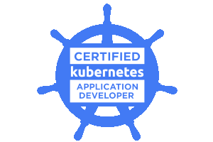
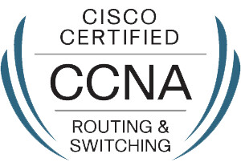
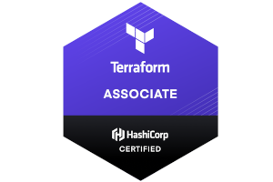

## About Me

Backend developer, DevOps, SRE, Cloud engineer, Technical recruiter, certified google cloud architect.

OSS fan, Linux follower, a geek who lives in a basement but is not afraid of other people.

Job profile
I may be a good fit to the roles like:

* Software Engineer
* Backend Developer
* DevOps Developer (Development and Ops for single product)
* Platform Engineer
* Consultant
* Architect

I’m not interested in roles like:

* Support engineer
* Operations engineer
* Front-End Developer
* DevOps (as new name for Admin who can code)

---

## Skills

### System Engineering

| scale | technology | details|
|---|---|---|
| ⬛️⬛️⬛️⬛️⬛️ Linux | ubuntu, systemd, packaging, etc, software development, ... |
| ⬛️⬛️⬛️⬛️⬜️  | System optimalization | atop, strace, dstat, iotop, sar, ss, understanding of few files in /proc and /dev |
| ⬛️⬛️⬛️⬜️⬜️  | Unix | FreeBSD, pfSense, ports |
| ⬛️⬛️⬜️⬜️⬜️  | Network troubleshooting | ss, ip r, tcpflow, tcpdump, overall average understanding of network |
### Cloud

| scale | technology | details|
|---|---|---|
| ⬛️⬛️⬛️⬛️⬛️ |cloud | ceph |
| ⬛️⬛️⬛️⬛️⬛️ |Containers | Docker, docker-compose |
| ⬛️⬛️⬛️⬛️⬛️ |gcp | gcs, gcr, gke, functions, bigtable, cloudSQL, iam, pubsub, compute, appengine, ... |
| ⬛️⬛️⬛️⬛️⬛️ |k8s | manifests, helm, opa, rbac, spinnaker, network policies, ... |
| ⬛️⬛️⬛️⬛️⬜️  | aws | s3, ec2, ecs, lambda, dynamodb, sns, iam, beanstalk, cloudwatch, ... |
| ⬛️⬛️⬛️⬜️⬜️  | Service Mesh | istio |
| ⬛️⬛️⬛️⬜️⬜️  | cloud | openstack, vmware, marathon |
| ⬛️⬛️⬛️⬜️⬜️  | Network | routing, switching |
| ⬛️⬛️⬛️⬜️⬜️  | Containers | kaniko |
| ⬛️⬛️⬜️⬜️⬜️  | Containers | systemd-nspawn |
| ⬛️⬛️⬜️⬜️⬜️  | azure | event mesh, ad, blob, webapp, ingestion |

### Programming

| scale | technology | details|
|---|---|---|
| ⬛️⬛️⬛️⬛️⬛️ | python | pep8, pytest, flask, sqlalchemy, paramiko, pdb, packaging, celery, virtualenv |
| ⬛️⬛️⬛️⬛️⬛️ | Orchestrization | Puppet, Ansible |
| ⬛️⬛️⬛️⬛️⬛️ | IaC | Terraform |
| ⬛️⬛️⬛️⬛️⬜️  | Scripting | Bash, sh, spellcheck |
| ⬛️⬛️⬛️⬛️⬜️  | api | graphql, rest |
| ⬛️⬛️⬛️⬜️⬜️  | api | grpc |
| ⬛️⬛️⬛️⬜️⬜️  | Go | gin, kingpin, chi, testify, minikube(merges) |
| ⬛️⬛️⬛️⬜️⬜️  | Scripting | ruby, perl |
| ⬛️⬛️⬜️⬜️⬜️  | Lambda | Serverless framework |
| ⬛️⬛️⬜️⬜️⬜️  | Orchestrization | Salt |
| ⬛️⬛️⬜️⬜️⬜️  | IaC | Cloud Formation |
| ⬛️⬛️⬜️⬜️⬜️  | Rust | cargo, redox(merges) |
| ⬛️⬛️⬜️⬜️⬜️  | JS | k6 |

### SRE

| scale | technology | details|
|---|---|---|
| ⬛️⬛️⬛️⬛️⬛️ monitoring | Icinga |
| ⬛️⬛️⬛️⬛️⬜️  | metrics | influxDB, telegraf, grafana, prometheus |
| ⬛️⬛️⬛️⬛️⬜️  | All in one | New Relic, stackdriver |
| ⬛️⬛️⬛️⬜️⬜️  | Logs | ELK, awslogs, graylog, filebeat, munin |

### CI/CD

| scale | technology | details|
|---|---|---|
| ⬛️⬛️⬛️⬛️⬜️  | CI | gitlab, cloudbuild |
| ⬛️⬛️⬛️⬜️⬜️  | CD | spinnaker, jenkins, GitHub actions |
| ⬛️⬛️⬜️⬜️⬜️  | CI | CDS, stash, jira, GHE |

### Other

| scale | technology | details|
|---|---|---|
| ⬛️⬛️⬛️⬛️⬜️  | cvs | git |
| ⬛️⬛️⬛️⬜️⬜️  | db | mysql, galera, postgres |
| ⬛️⬛️⬛️⬜️⬜️  | www | nginx, apache2, envoy |
| ⬛️⬛️⬛️⬜️⬜️  | lb | haproxy |
| ⬛️⬛️⬛️⬜️⬜️  | queues | rabbitmq |
| ⬛️⬛️⬛️⬜️⬜️  | caching | redis, varnish |
| ⬛️⬛️⬛️⬜️⬜️  | db(nosql) | mongodb, firestore |
| ⬛️⬛️⬛️⬜️⬜️  | markdown | readme, images, links |
| ⬛️⬛️⬛️⬜️⬜️  | blue | firewalls, iam, least priviledges, fail2ban, common sense, ... |
| ⬛️⬛️⬛️⬜️⬜️  | CTF | puzzles, obfuscation, rev-engineering |
| ⬛️⬛️⬜️⬜️⬜️  | red | basic msf, sqlinjection, ddos, overall script kiddie plus level |

---

## Experience

### [ANZ](https://www.anz.com.au)

Software engineer

January 2019 - Now Melbourne, Australia

Developing Platform shared by many tribes & teams. Implementing new workflows for applications deployment. Introducing GCP and K8S to the teams. Providing support and advices for appliaction architecture. Providing clean and scalable architecture for shared platform. Implementing various solution using wide toolset. Dealing with various tasks range starting with regular application development to fully declarative security improvements and infrastructure management. Being technical lead for GCP based projects.

#### GCP/K8S

* GKE (cluster,istio,namespaces,rbac,network policies) - * terraform, helm, yaml, kustomize
* gcr, gsr, gcs, iam, cloudbuild, cloudsql, pubsub, firebase - terraform / terragrunt
* opa policies - rego
* monitoring - stackdriver, jeager, kiali, prometheus, grafana

#### CI/CD

* Spinnaker
* CloudBuild
* Bamboo
* Artifactory
* Custom tools (pubsub based integration)

#### Software Architecture

* Guiding team members
* Design pipelines & deployment
* Design parts of the system
* Providing diagrams for infrastructure and security forums
* Participating in high level architectural and security decisions

#### Software Engineering

* Applications development - python3, go
* Linters - shellcheck, pylint, bandit, golangci-lit, gosec …
* Code review
* Providing documentation

#### Linux

* Kernel tuning
* Troubleshouting

#### Guiding and providing trainings for the teams

* Python development
* Docker optimalization
* K8S
* GCP
* Terraform
* service mesh
* CI/CD best practices
* Linux

#### Soft Skills

* Technical leading
* Interviewing candidates for general engineering position
* Designing interview schema for cloud engineers/DevOps
* Distributing tasks for group of engineers (from 2 to 5 engineers)

---

### [Silverpond](https://silverpond.com.au/)

Backend development and introducing DevOps culture. Providing new features for customer and bugfixes for various AI applications. Preparing pipelines and automatization for reproducibility and deployment.

#### Software Engineering

* uServices, API, data processing, libraries - python, Go
* Performance optimalization - python
* Linters - pylint, black
* Refactor application to be cloud agnosic - ruby

#### Security policies

* Design and implement security & disaster recovery policies
* Harden operating systems
* Critical data encryption
* Access revoke automation, unnecessary access restrictions
* Providing draft plans for security improvements
* Logs Collection

#### Design and implementation

* Bypassing geo-blocking - Lambda
* Monitoring - New Relic
* Backup - restic, minio
* Centralized logs - ELK & awslogs
* Metrics - InfluxDB, telegraf & Grafana
* IaaC - Terragrunt & Terraform
* Orchestration - Ansible
* Various API - python

#### CI/CD

* gitlab - git-hooks & build jobs
* packaging - process for building wheels
* Introducing pypisever
* Contenerization - Docker

---

### [OVH](https://www.ovh.pl/)

DevOps Developer

September 2016 - September 2018 Wroclaw, Poland

Developing distributed system to manage IaaS solution for Ceph (Distributed storage). Working on a scale (20K+ nodes) for cloud provider as a part of cross functional DevOps team. Providing a high available solution in distributed environment.

#### Developing new features, bug-fixes and orchestration

* Businesses logic, data processing, uServices - python
* Orchestration - puppet
* IaaC - Terraform
* Minor improvements - Go
* Test - pytest, OpenStack api

#### Developing and providing integration

* Messaging - rabbitmq
* Async tasks - celery
* Synchronization - ZooKeeper
* Contenerization - Docker

#### CI/CD

* Build system - CDS
* Deployment - Marathon
* Developing self-healing system based on event-bus

#### SRE

* Monitoring refactor & redesign
  * Multi-master,multi-slave Icinga2 based monitoring.
  * 200 000 checks per minute (plus possible extension via horizontal scaling)
* On call duty participation
* Preparing separate production environment due to Patriot Act in the USA

#### Soft Skills

* Training US team to take responsibility for the product
* Introducing and mentoring junior dev which joined the team
* Representing company on job fairs

---
### [Nokia](https://nokiawroclaw.pl/)

DevOps

October 2015 - August 2016

Developing and maintaining distributed CI/CD solutions for internal purposes (about 1500 CPU). Providing distributed and high available solution for cached build workspaces.

#### Developing internal tools

* Processing logic - Python, Bash
* Scripts - Bash, Perl
* Orchestrization - Puppet
* Refactoring build systems - CMake, Make

CI

* Build system - Jenkins
* Contenerization - Docker
* Design & implementation

### [Nokia](https://nokiawroclaw.pl/)

Software Developer

June 2014 - May 2015 Wroclaw, Poland

Backup for satellite infrastructure - Duplicity
Commit hooks - git, svn
Developing backup and restore system for network elements in telecommunication systems.

#### Software Engineering:

* Data processing, business logic - Python
* Automatization - Bash
* Rest api - cherrypy, swagger
* IPv6 support
* SELinux policies

#### Tests

* pytest
* Robot framework

---

## Education

### Master of Science, Computer Science

Wroclaw University of Technology

February 2016 - July 2017 Wroclaw, Poland

Thesis: Performance analysis for chosen Linux distro virtualized on Mikrotik router (Test performance of guest and host OS on Mikrotik RB with various loads)

### Bachelor of Science, Computer Science

Wroclaw University of Technology

September 2010 - February 2015 Wroclaw, Poland

Thesis: Application supporting work of experts using the polygraph (Hardware & Software)

---

## Certifications

[Google Cloud Certified Professional Cloud Architect](https://bit.ly/2xpKN6a)

[Certified Kubernetes Application Developer (CKAD)](../img/cisco.pdf)

[CCNA Routing and switching - Scaling Networks](https://bit.ly/34vQsnn)

[HashiCorp Certified: Terraform Associate](TODO)

---

## Talks

* python - weird behaviours - Unconference, Melbourne, Australia 16 Oct 2019
* honeypots - Geeks night, Wrocław, Poland 16 Mar 2013

---

## Projects

### Upstream OpenSource

* cpython (8+ commits - docs, bugfix)
* minikube (kubernetes project) (75+ commits - tests, features, refactors)
* redox-os (10+ commits - coreutils, extrautils)
* terraform (2+ docs)
* cloud builders community (10+ commits - builders)

### Custom Projects:
* [sidecar http dispatcher - App to dispatch requests base on headers](https://github.com/n0npax/sidecar_http_dispatcher/)
  * Platform - Any(example for K8S)
  * Logic - Go
  * Performance tests - k6
* [Lime-comb - secrets sharing solution(backend)](https://github.com/n0npax/lime-comb)
  * Platform - App engine/firebase
  * Metrics - stackdriver
  * Logic - Python
  * Api - graphql
* [Wiatrol.app - glider flight management app](https://wiatrol.app/)
  * Platform - App engine/firebase
  * Metrics - stackdriver
  * Logic - Python
  * Api - graphql
* Flower watering system
  * Platform - K8S
  * Metrics - Influx stack
  * Logic - Python/Go
  * Caching - Redis
* [Dummy operating system](https://bitbucket.org/n0npax/ziemniakos/src/master/)
  * Dummy operating system which jumps to protected mode and display potatoOS text
  * kernel and bootloader (asm)
* LieHunter - polygraph
  * Logic - Python/C
  * Data collection - RPI/adc
  * Dummy electric circuit
* WebRatRipper - computing liver cellule parameters
  * Logic - python
  * graphs - plotly

